<div align="center">

# Molecule3D

**A free, GPU-accelerated LAMMPS workbench and 3D molecular structure viewer that runs entirely in your browser.**

*Free for education and non-commercial research · attribution required · [commercial use needs a licence](COMMERCIAL.md)*

Load **LAMMPS**, **XYZ**, **PDB** and **CIF** structures by drag & drop and explore them in real-time 3D — no install, no upload, no account.

[](https://shuvam-banerji-seal.github.io/lammps-web-gui/)
[](https://github.com/Shuvam-Banerji-Seal/lammps-web-gui/actions/workflows/ci.yml)
[](https://github.com/Shuvam-Banerji-Seal/lammps-web-gui/actions/workflows/deploy.yml)
[](#development)
[](LICENSE)
[](COMMERCIAL.md)

</div>

---

## 📸 Screenshots

| Script Builder — editable flowchart | Structure Viewer — C60 |
|---|---|
| 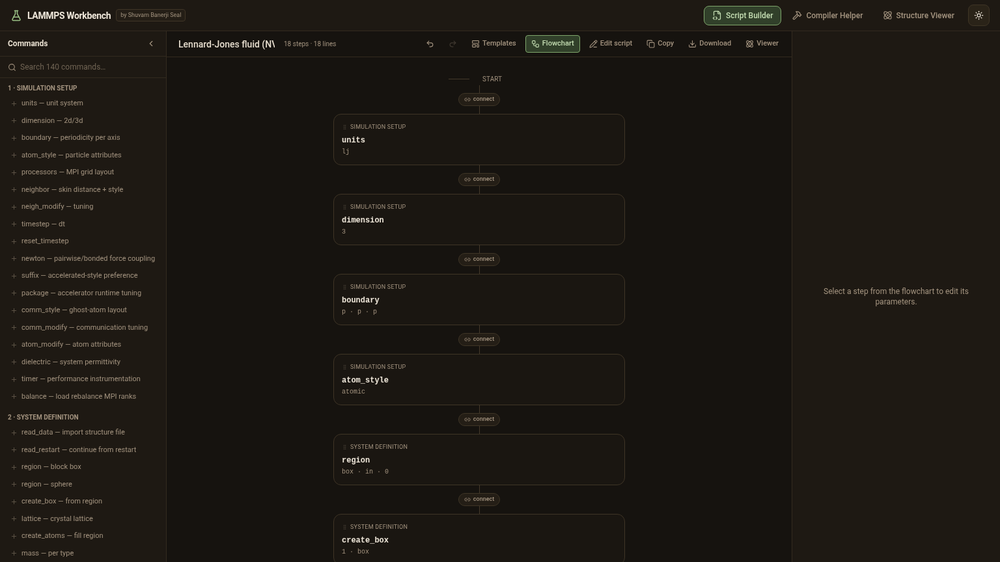 | 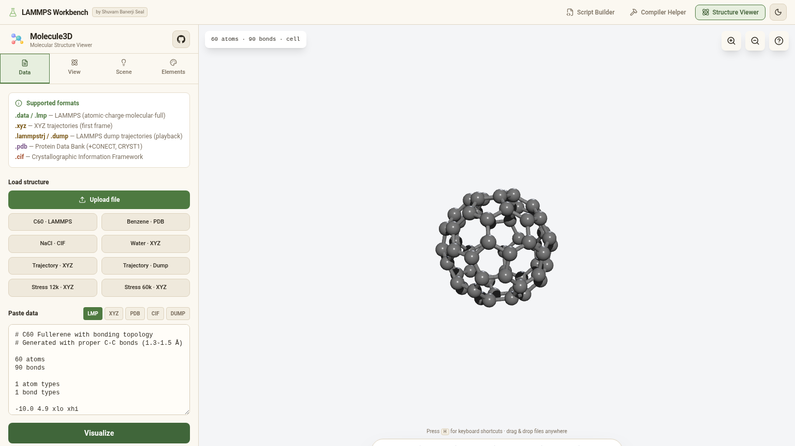 |
| **Compiler Helper — click-to-inspect flags** | **Dump trajectory playback** |
| 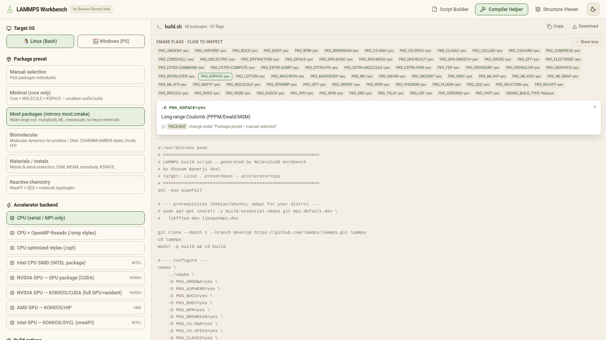 | 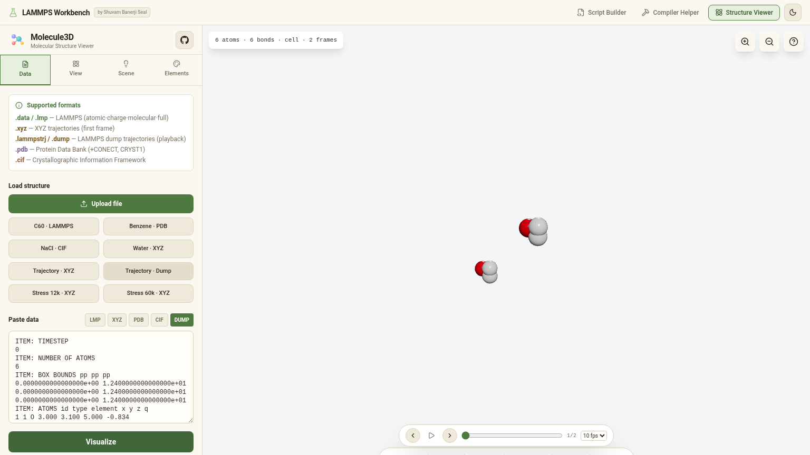 |
| **Simulation box (NaCl, CIF)** | **Starter templates** |
| 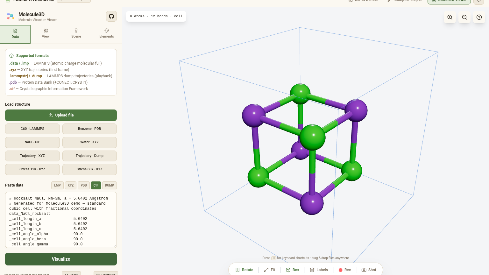 | 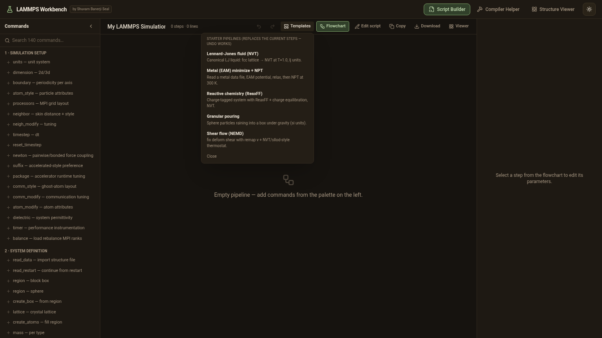 |
| **Warm light theme** | **Keyboard shortcuts overlay** |
| 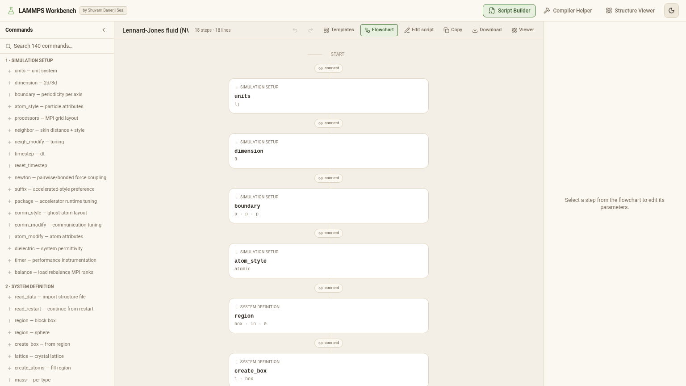 | 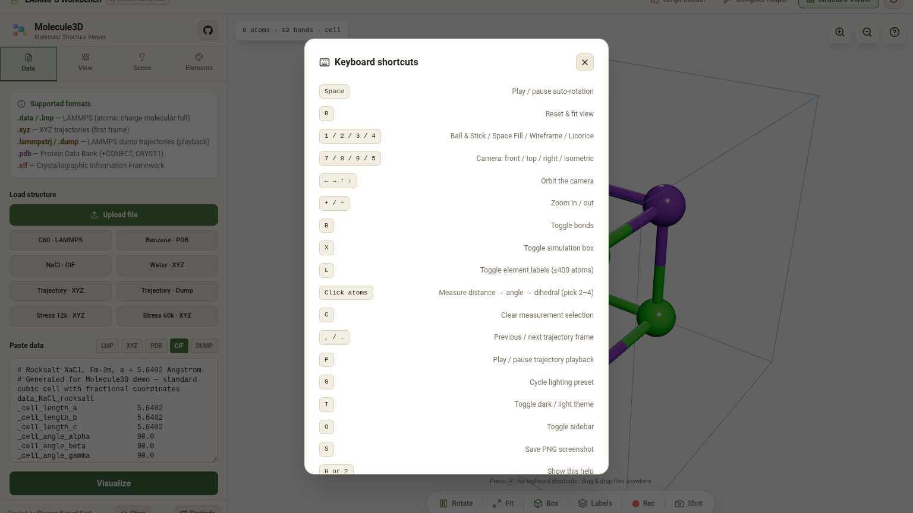 |
| **Mobile** | **Trajectory Analysis — RDF/MSD** |
| 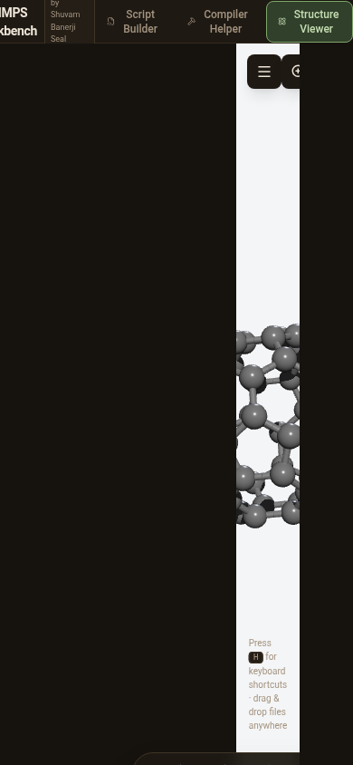 | 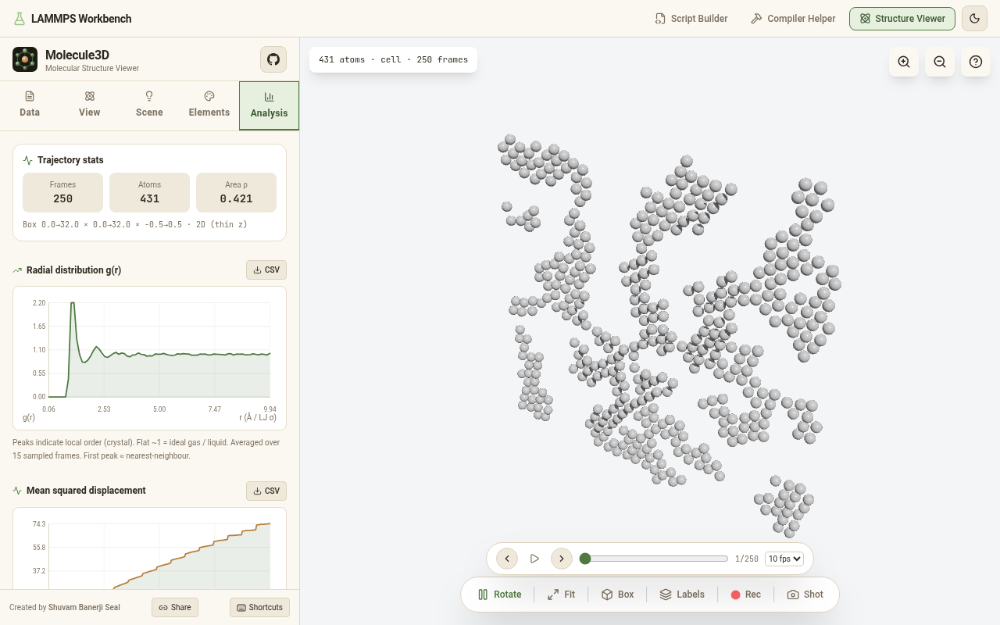 |
| **Analysis — mobile** | **Concept branching — one flowchart, several ideas** |
| 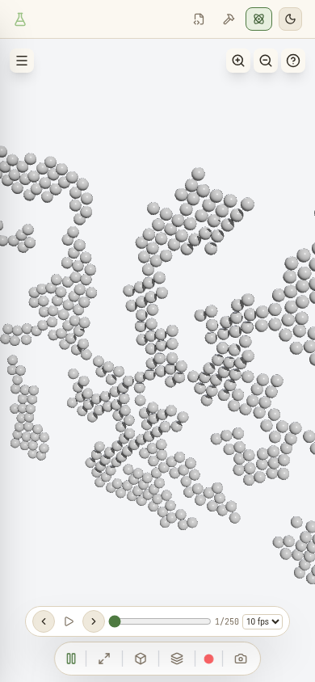 | 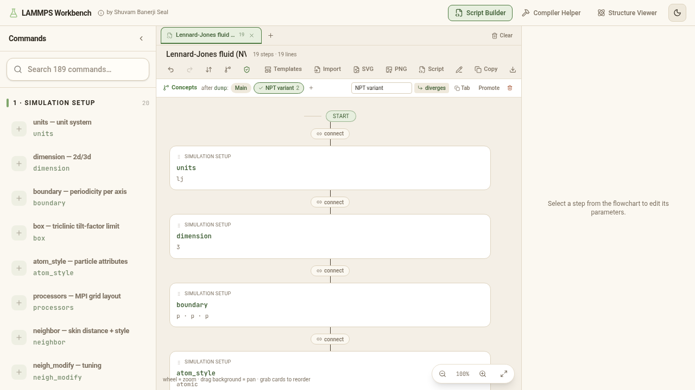 |
| **Script check — doc-grounded validation** | **Viewer dock on a phone** |
| 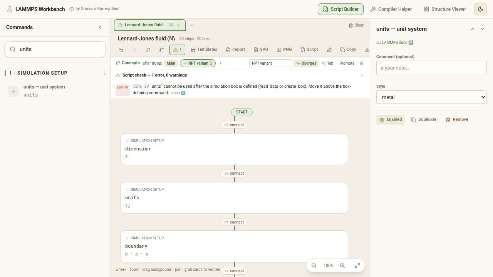 | 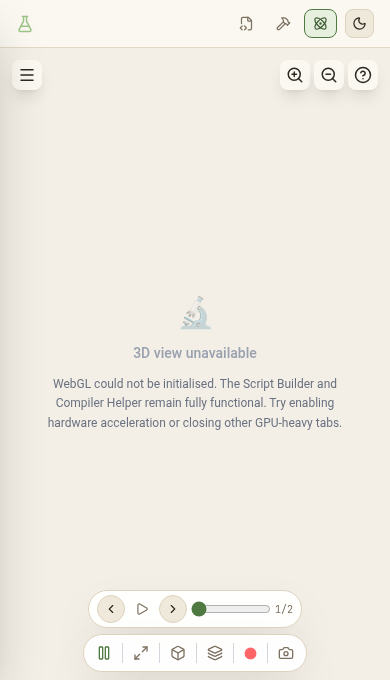 |

## 🎬 Simulation Videos — rendered **in-browser**

The viewer plays **LAMMPS dump** (`.lammpstrj`/`.dump`) natively and exports **MP4/WebM at 60 fps** — no Python needed. The 15 s clip below was recorded **directly from this website** (canvas capture) at 896×752, stitched from the three GPU trajectories in [`introduction-to-molecular-simulation/simulations`](https://github.com/Shuvam-Banerji-Seal/introduction-to-molecular-simulation/tree/main/simulations):

<video src="https://raw.githubusercontent.com/Shuvam-Banerji-Seal/lammps-web-gui/main/docs/videos/simulations_demo.mp4" controls muted loop playsinline width="100%" poster="docs/screenshots/viewer-dump-playback.png"></video>

*Left to right: **01 Ideal Gas** (194 atoms × 200 frames, dilute LJ NVE 30×30) → **02 LJ Freezing** (431×200, NVT 3.0→0.3, FCC) → **03 Water-Ice** (431×250, NVT 2.0→0.01, deep quench). Load any `.lammpstrj` via drag-drop or **Paste data → DUMP → Visualize** → scrub with the playback bar (`P` / `,` / `.`, 2–30 fps) → **● Rec** to save MP4.*

*Raw file: [`docs/videos/simulations_demo.mp4`](docs/videos/simulations_demo.mp4) (188 KB, H.264, 30 fps) — also at `/videos/simulations_demo.mp4` on the [live site](https://shuvam-banerji-seal.github.io/lammps-web-gui/videos/simulations_demo.mp4).*

## ✨ Features

- 🌿 **Concept branching — divergent ideas in one flowchart.** Hover any step and hit the branch icon to *fork the pipeline from that point onward*. The new concept starts as a **copy of the rest of your pipeline**, so you edit a variant instead of rebuilding from scratch: swap the thermostat, try a different pair style, extend the production run. Switch between **Main line** and each concept with one click — the generated script, the warnings and the SVG export all follow whichever concept is taken. A concept either **replaces** everything after the fork (truly divergent) or **rejoins** the main line (a detour), and the steps it cut off stay visible, ghosted, under *"not in this concept"*. When one idea wins, **Promote** folds it into the main line and drops its rivals; **Tab** flattens any concept into its own flowchart tab for side-by-side comparison. Several forks can be open at once.
- ✅ **Script check — validation against the LAMMPS rules, not vibes.** A linter reads the *final* script (generated or hand-edited) and flags what LAMMPS would reject or silently do wrong: header-only commands used after the box (`units`, `dimension`, `boundary`, `atom_style`), commands used before it (`pair_coeff`, `mass`, `velocity`, `create_atoms`), `unfix`/`undump`/`uncompute` of an ID that was never defined, fix/dump/compute ID reuse with a different style, groups and regions referenced before definition, a `run` with no time-integration fix, `pair_style reaxff` without charge equilibration, and kspace/pair-style mismatches. **Every rule quotes the `docs.lammps.org` page it enforces and links to it**, and the whole rule set is verified silent on the official example scripts (`in.melt`, `in.heatflux`, `in.msd.2d`, `in.cos.1000SPCE`) — a linter that cries wolf on `in.melt` would be worse than none. Every shipped template is asserted to pass with zero errors *and* zero warnings.
- ⬇️ **Pipeline-order emission.** The script comes out in exactly the order the flowchart shows, because LAMMPS executes an input file top to bottom and the docs are explicit that the settings/run phases *"can be repeated as many times as desired"*. That makes multi-stage scripts work: `run` → `reset_timestep` → `run`, a second `dump` opened after a stage, and `write_data` **after** the run rather than before it. A **Sort** action still reorders into canonical section order on demand — it moves the steps, so the flowchart never disagrees with the script.
- 🧪 **LAMMPS Workbench** — three integrated modules: a visual **Script Builder** (flowchart pipeline of 186 curated commands — the complete general-command surface, locked by a coverage test against docs.lammps.org), a **Compiler Helper** (package/accelerator presets → ready-to-run CMake build scripts) and the 3D **Structure Viewer**.
- 💾 **Everything persists** — your script pipeline, compiler options, active module and light/dark theme survive module switches *and* page reloads (local-only, nothing uploaded).
- 🧩 **Editable flowchart** — grab any card and drop it between two others (it locks into place with a live insertion indicator), pan by dragging the background, zoom with the mouse wheel (35–250%), click any **connect** pill to insert a command at that exact spot. Prefer raw text? **Edit script** switches to a hand-editing mode that emits your text verbatim.
- 📥 **Import existing scripts** — load any `in.*` LAMMPS input and the flowchart builds itself: commands are matched back to editable parameter forms (user-chosen fix/dump/compute IDs handled), unknown lines are preserved verbatim as raw steps — nothing is lost.
- 🖼️ **Presentable flowchart export** — one click downloads the pipeline as a crisp **SVG** or 2× **PNG** (themed, titled, dated) for papers, slides and READMEs.
- 🏗️ **Compiler Helper with the full flag surface** — 27 CMake build options (FFT/Kokkos-FFT/heFFTe, OpenMP, GPU back end/precision/arch, Kokkos precision, JPEG/PNG/FFMPEG, exceptions, rpath…) each with a click-to-read description sourced from the build docs.
- ↩️ **Undo / redo** — every builder action is undoable (`Ctrl+Z` / `Ctrl+Shift+Z`), including template loads; duplicate any step with its parameters; `Delete` removes the selected step.
- 📋 **Starter templates** — one-click pipelines for LJ fluid NVT, EAM metal relax+NPT, ReaxFF chemistry, granular pouring and NEMD shear — all generate warning-free scripts.
- 📚 **186-command library** — every general LAMMPS command (locked by a coverage test against docs.lammps.org), rich editors for the popular fix/compute styles, and free-form any-style `fix`/`dump`/`compute` escape hatches covering the ~900 style surface — setup, system, interactions, output and run-control commands with per-parameter editors and links to the official docs; style enumerations verified against docs.lammps.org.
- 🔍 **CMake flag inspector** — the Compiler Helper lists *every* `-D` flag as an expandable chip set; click any flag to read what it does and where to change it.
- 🌰 **Warm light/dark themes** — a coffee-and-sage dark palette (no blue tint, no gradients) and a warm-paper light theme, switchable app-wide.
- 🧊 **True 3D rendering** — depth-correct perspective view of atoms, bonds and the simulation cell, powered by three.js / React Three Fiber.
- 📐 **Measurement tools** — click 2–4 atoms for live distance / angle / dihedral readouts with on-canvas overlays.
- 🎞️ **Trajectory playback** — multi-frame XYZ **and LAMMPS dump** files get a scrubber with play/pause and 2–30 fps speeds (`P`, `,`, `.`).
- 📊 **Trajectory analysis** — the **Analysis** tab for dump trajectories: **RDF g(r)** (2D/3D PBC-aware), **MSD vs lag** (minimum-image, time-origin averaged, ID-following), **density profiles**, **speed histograms** (if `vx vy vz`), all as SVG charts with CSV export. Runs in a worker, once per structure. The physics is unit-tested, not just eyeballed: `g(r)→1` for a random gas, first and second shells of a simple-cubic lattice at `a` and `a√2`, MSD exactly `(v·t)²` under uniform drift, zero for a frozen structure, and correct across a periodic wrap.
- 🔬 **Improved LAMMPS dump rendering** — handles `x y z` / `xu yu zu` / `xs ys zs`, optional `vx vy vz` velocities, thin 2D boxes (`-0.5→0.5`) with correct PBC and box display.
- 🔗 **Shareable views** — the Share button copies a URL that restores your exact visualization settings.
- 📁 **Four structure formats**
  | Format | Extensions | Highlights |
  |---|---|---|
  | LAMMPS data | `.data` `.lmp` `.lammps` | `atomic` · `charge` · `molecular` · `full` atom styles, box bounds incl. triclinic tilt (`xy xz yz`) |
  | XYZ | `.xyz` | first frame of trajectories, chemistry-aware bond inference |
  | Protein Data Bank | `.pdb` `.ent` | `CONECT` bonds, `CRYST1` unit cell |
  | CIF | `.cif` `.mmcif` | fractional ↔ Cartesian conversion, triclinic cells as true parallelepipeds |
- 🎨 **All 118 elements** resolved by symbol from *any* format and colored with standard **CPK/Jmol** palettes; per-type recoloring in the sidebar.
- ⚡ **Large-system performance** — atoms *and* bonds render as single instanced draw calls with instance matrices written straight into the GPU buffer (no per-atom `Object3D` compose, no per-instance colour string re-parsing); bond inference uses an O(n) spatial hash grid; adaptive device-pixel-ratio and tessellation scale with system size; FPS-adaptive quality degradation; `frameloop="demand"` means zero idle GPU burn.
- 🧵 **Two Web Workers, so the UI never freezes** — parsing runs off the main thread, and so does trajectory analysis. **RDF uses a periodic cell list** instead of an all-pairs loop: measured **7× faster at 10 000 atoms and 36× at 30 000** (36.9 s → 1.0 s), with the accelerated histogram asserted bin-for-bin identical to a brute-force reference. MSD resolves a stable atom ordering once instead of rebuilding a lookup inside its inner loop.
- 🎬 **High-quality video export** — one-click recording of the live canvas at up to 60 fps and ~24 Mbps, saved as MP4 (H.264) where the browser supports it, WebM (VP9/VP8) otherwise.
- 💡 **Five lighting rigs** (studio · lab · outdoor · space · soft) plus four materials (realistic · plastic · metallic · toon).
- 📦 **Simulation box display** for LAMMPS bounds, PDB `CRYST1` and CIF cells — triclinic cells render correctly, never faked as cubes.
- ⌨️ **Full keyboard control** with an in-app shortcut overlay (`H`).
- 🖱️ **Drag & drop** files anywhere on the page; hover any atom for element details.
- ↔️ **Resizable sidebar** — drag its edge to any width between 280–560 px; the choice persists.
- 🌓 Dark / light themes, mobile-friendly layout, PNG screenshots.

## 🚀 Quick start

Open the [live demo](https://shuvam-banerji-seal.github.io/lammps-web-gui/) and:

1. Drag a `.data` / `.xyz` / `.pdb` / `.cif` file onto the page, or
2. Try the bundled examples (C60 fullerene, benzene, rocksalt NaCl, water cluster).

Your files never leave your machine — parsing happens locally in the browser.

## ⌨️ Keyboard shortcuts

### Script Builder

| Key | Action |
|---|---|
| `/` | Focus the command palette search |
| `B` | **Fork a concept** at the selected step (or at the end) |
| `[` `]` | Cycle which concept is taken at that fork |
| `F` | Fit the whole pipeline in view |
| `0` | Back to 100%, centred |
| `S` | Toggle flowchart ⇄ generated script |
| `C` | Toggle the Script check panel |
| `Delete` | Remove the selected step |
| `Esc` | Deselect / close any open menu |
| `Ctrl+Z` / `Ctrl+Shift+Z` | Undo / redo (includes template loads and forks) |

Typing targets are always skipped, so the manual-script editor and every
parameter field keep their native behaviour.

### Structure Viewer

| Key | Action |
|---|---|
| `Space` | Play / pause auto-rotation |
| `R` | Reset & fit view |
| `1` `2` `3` `4` | Ball & Stick · Space Fill · Wireframe · Licorice |
| `7` `8` `9` `5` | Camera: front · top · right · isometric |
| `←` `→` `↑` `↓` | Orbit camera |
| `+` / `−` | Zoom in / out |
| `B` | Toggle bonds |
| `X` | Toggle simulation box |
| `L` | Toggle element labels (≤400 atoms) |
| Click atoms | Measure distance → angle → dihedral (pick 2–4) |
| `C` | Clear measurement selection |
| `,` / `.` | Previous / next trajectory frame |
| `P` | Play / pause trajectory playback |
| `G` | Cycle lighting preset |
| `T` | Toggle dark / light theme |
| `O` | Toggle sidebar |
| `S` | Save PNG screenshot |
| `H` or `?` | Shortcut overlay |
| `Esc` | Close panels |

## 🛠️ Technology

- [React 19](https://react.dev/) + TypeScript
- [three.js](https://threejs.org/) via [@react-three/fiber](https://docs.pmnd.rs/react-three-fiber) & [@react-three/drei](https://github.com/pmndrs/drei)
- [Vite 8](https://vite.dev/) + [Tailwind CSS 4](https://tailwindcss.com/)
- [Vitest](https://vitest.dev/) — 158 parser/chemistry/catalog/import/coverage unit tests
- Zero runtime third-party requests: fonts, colors, lighting — all local.

## 💻 Development

```bash
git clone https://github.com/Shuvam-Banerji-Seal/lammps-web-gui.git
cd lammps-web-gui
npm install        # Node >= 20
npm run dev        # http://localhost:5173
npm test           # vitest suite
npm run typecheck  # tsc --noEmit
npm run build      # production build → dist/
```

Project layout:

```
├── src/                     # application source
│   ├── main.tsx                   # entry point
│   ├── App.tsx                    # workbench shell, module switcher, global theme
│   ├── theme.ts                   # shared warm coffee-green light/dark tokens
│   ├── styles.css                 # Tailwind v4 entry + base styles
│   ├── constants.ts               # CPK colors + covalent radii (118 elements)
│   ├── types.ts
│   ├── components/          # React Three Fiber scene components
│   │   ├── MoleculeCanvas.tsx     # Canvas, adaptive DPR, hover picking
│   │   ├── InstancedAtomMesh.tsx  # one draw call for all atoms
│   │   ├── InstancedBondMesh.tsx  # one draw call for all bonds (half-bond coloring)
│   │   ├── SimulationBox.tsx      # box/triclinic cell wireframe
│   │   ├── LightingRig.tsx        # five lighting presets
│   │   ├── CameraRig.tsx          # fit/preset/zoom/orbit command handling
│   │   ├── AtomLabels.tsx         # canvas-texture element badges
│   │   ├── MeasurementOverlay.tsx # selection rings + measurement visuals
│   │   └── workbench/             # Script Builder · Compiler Helper · Viewer shell
│   ├── lammps/              # workbench logic (pure, fully tested)
│   │   ├── templates.ts           # one-click starter pipelines
│   │   ├── scriptParser.ts        # import in.* scripts → flowchart steps
│   ├── flowchartSvg.ts            # presentable SVG/PNG flowchart export
│   │   ├── catalog.ts             # 171-command declarative library
│   │   ├── generator.ts           # model → in.lammps (+ manual-edit mode)
│   │   ├── compiler.ts            # packages/presets → CMake script + flag docs
│   │   └── exporter.ts            # data-file writer + download helper
│   ├── services/            # parsers & geometry logic (pure functions, fully tested)
│   │   ├── parser.ts              # LAMMPS (4 atom styles + box + tilts)
│   │   ├── xyzParser.ts           # XYZ incl. multi-frame trajectories
│   │   ├── pdbParser.ts           # PDB (+CONECT, CRYST1)
│   │   ├── cifParser.ts           # CIF (fractional coords, triclinic)
│   │   ├── dumpParser.ts          # LAMMPS dump trajectories (.lammpstrj)
│   │   ├── bondInference.ts       # O(n) spatial-hash covalent bonding
│   │   ├── measure.ts             # distance / angle / dihedral math
│   │   ├── persistence.ts         # safe JSON localStorage layer
│   │   └── viewState.ts           # shareable ?s= view encoding
│   ├── hooks/               # keyboard · persistence · trajectory analysis
│   └── workers/             # parser + trajectory-analysis Web Workers
├── tests/                   # vitest suites (parsers, chemistry, catalog, persistence)
├── public/                  # static assets + example structures
├── docs/screenshots/
├── scripts/                 # wiki publisher, size budget check
├── wiki/                    # versioned GitHub wiki source
└── .github/workflows/       # CI (typecheck·test·audit·build) + Pages deploy
```

## 📦 Deployment

Every push to `main` runs CI (typecheck → tests → `npm audit` → build → bundle
budget, on Node 22 and 24) and deploys the static build to GitHub Pages via
GitHub Actions.

**There is no backend, by design.** Every parser, the script generator, the
validator and all the trajectory analysis run in your browser — your files
never leave your machine. A legacy Flask stub used to sit in `server/`; it was
unused by the deployed site and carried its own CVEs, so it was removed (it is
still in the git history if you ever want it back).

`main` is protected: direct pushes are blocked and every change lands through a
pull request that must pass CI on both Node lines, dependency review, CodeQL
and code-owner review. See [CONTRIBUTING.md](CONTRIBUTING.md#branch-protection-and-the-pr-flow).

## 🔍 Search indexing

The site ships `robots.txt`, `sitemap.xml`, Open Graph/Twitter meta and JSON-LD
(`WebApplication`) structured data for search engines. After major releases,
the URL can be (re-)submitted through
[Google Search Console](https://search.google.com/search-console) → *URL inspection* → *Request indexing*.

## 🤝 Contributing

PRs welcome! Please read [CONTRIBUTING.md](CONTRIBUTING.md) and our
[Code of Conduct](CODE_OF_CONDUCT.md). By opening a PR you license your
contribution to the author under [LICENSE §6](LICENSE) so it can ship as part
of the project — you keep your copyright and get credited. Security issues go through
[private advisories](SECURITY.md) — please don't open public issues for them.

The project wiki has deeper documentation:
[format guides](https://github.com/Shuvam-Banerji-Seal/lammps-web-gui/wiki),
[performance notes](https://github.com/Shuvam-Banerji-Seal/lammps-web-gui/wiki/Performance)
and more.

## 📄 License

**[LAMMPS Web GUI / Molecule3D Educational and Non-Commercial Source-Available
Licence v1.0](LICENSE)** © 2025–2026 Shuvam Banerji Seal. All rights reserved.

This is **source-available, not open source**. In plain terms:

| | |
|---|---|
| ✅ **Free** | Education, teaching, coursework, theses, academic research, personal study — clone it, modify it, fork it, share it at no charge. |
| ✅ **Free** | Universities, schools, research institutes, national labs, public libraries and museums, for their educational and academic mission. |
| ⚠️ **Required** | **Credit Shuvam Banerji Seal.** Keep the notices in the source, keep the visible credit in any build you deploy, and **cite the project** in any paper, thesis or poster it helped produce — see [`CITATION.cff`](CITATION.cff). Attribution is a licence condition (§3), not a courtesy. |
| ❌ **Not allowed** | Selling it, hosting it as a paid or ad-supported service, using it inside a for-profit company to build what you sell, paid consulting or training, or bundling it into a commercial product. |
| 📩 **Ask first** | Commercial use is available **by written permission**, with a revenue share (10% of gross by default, negotiable — reduced or waived terms are genuinely available for spin-offs, non-profits and small teams). Read [**COMMERCIAL.md**](COMMERCIAL.md) and email <shuvam@sycolex.com>. |

Redistributing it? Ship [`LICENSE`](LICENSE) and [`NOTICE`](NOTICE) unmodified,
keep every credit intact, and keep this same licence on your derivative work.

Releases made **before 22 September 2026** were MIT-licensed; that grant is not
revoked for those copies (LICENSE §11).

Third-party dependencies (React, three.js, Tailwind, …) keep their own licences
— see [`NOTICE`](NOTICE). **LAMMPS** itself is a separate GPL-2.0 project of
Sandia National Laboratories and the LAMMPS Developers; this tool is
independent and is not affiliated with or endorsed by it.
